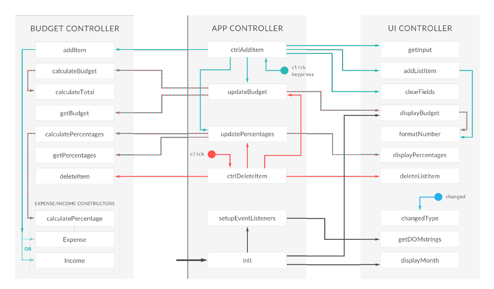

### Application name: Budget App
- Income/Expense Management

### Architecture


```js
// BUDGET CONTROLLER
var budgetController = (
	function() {
		var Expense = function(id, description, value) {};
		Expense.prototype.calcPercentage = function(totalIncome) {};
		Expense.prototype.getPercentage = function() {};
		var Income = function(id, description, value) {};
		var calculateTotal = function(type) {};
		var data = {};

		return {
			addItem: function(type, des, val) {},
			deleteItem: function(type, id) {},
			calculateBudget: function() {},
			calculatePercentages: function() {},
			getPercentages: function() {},
			getBudget: function() {},
			testing: function() {
				console.log(data);
			}
		};
	}
)();

// UI CONTROLLER
var UIController = (function() {
	function() {
		var DOMstrings = {};
		var formatNumber = function(num, type) {};
		var nodeListForEach = function(list, callback) {};

		return {
			getInput: function() {},
			addListItem: function(obj, type) {},
			deleteListItem: function(selectorID) {},
			clearFields: function() {},
			displayBudget: function(obj) {},
			displayPercentages: function(percentages) {},
			displayMonth: function() {},
			changedType: function() {},
			getDOMstrings: function() {}
		};
	
	}
)();

// GLOBAL APP CONTROLLER
var controller = (
	function(budgetCtrl, UICtrl) {
		var setupEventListeners = function() {};
		var updateBudget = function() {};
		var updatePercentages = function() {};
		var ctrlAddItem = function() {};
		var ctrlDeleteItem = function(event) {};

    return {
			init: function() {
				console.log('Application has started.');
				UICtrl.displayMonth();
				UICtrl.displayBudget();
				setupEventListeners();
			}
    };

	}
)(budgetController, UIController);

controller.init();
```

```html
 <body>      
	<div class="top">
		<div class="budget">
			<div class="budget__title">
				Available Budget in <span class="budget__title--month">%Month%</span>:
			</div>
			
			<div class="budget__value">+ 2,345.64</div>
			
			<div class="budget__income clearfix">
				<div class="budget__income--text">Income</div>
				<div class="right">
					<div class="budget__income--value">+ 4,300.00</div>
					<div class="budget__income--percentage">&nbsp;</div>
				</div>
			</div>
			
			<div class="budget__expenses clearfix">
				<div class="budget__expenses--text">Expenses</div>
				<div class="right clearfix">
					<div class="budget__expenses--value">- 1,954.36</div>
					<div class="budget__expenses--percentage">45%</div>
				</div>
			</div>
		</div>
	</div>
	
	<div class="bottom">
		<div class="add">
				<div class="add__container">
						<select class="add__type">
								<option value="inc" selected>+</option>
								<option value="exp">-</option>
						</select>
						<input type="text" class="add__description" placeholder="Add description">
						<input type="number" class="add__value" placeholder="Value">
						<button class="add__btn"><i class="ion-ios-checkmark-outline"></i></button>
				</div>
		</div>
		
		<div class="container clearfix">

			<div class="income">
				<h2 class="icome__title">Income</h2>			
				<div class="income__list"></div>
			</div>

			<div class="expenses">
				<h2 class="expenses__title">Expenses</h2>				
				<div class="expenses__list"></div>
			</div>

		</div>
			
			
	</div>
	<script src="app.js"></script>
</body>
```

### Development
- Add event handler
```js
/* controller */
// setupEventListeners
var setupEventListeners = function() {
	var DOM = UICtrl.getDOMstrings();
	document.querySelector(DOM.inputBtn).addEventListener('click', ctrlAddItem);
	
	document.addEventListener('keypress', function(event) {
		if (event.keyCode === 13 || event.which === 13) {
			ctrlAddItem();
		}
	});
	
	document.querySelector(DOM.container).addEventListener('click', ctrlDeleteItem);
	document.querySelector(DOM.inputType).addEventListener('change', UICtrl.changedType);        
};

/* UIController */
// DOMstrings
var DOMstrings = {
	inputType: '.add__type',
	inputDescription: '.add__description',
	inputValue: '.add__value',
	inputBtn: '.add__btn',
	incomeContainer: '.income__list',
	expensesContainer: '.expenses__list',
	budgetLabel: '.budget__value',
	incomeLabel: '.budget__income--value',
	expensesLabel: '.budget__expenses--value',
	percentageLabel: '.budget__expenses--percentage',
	container: '.container',
	expensesPercLabel: '.item__percentage',
	dateLabel: '.budget__title--month'
};

// getDOMstrings
getDOMstrings: function() {
	return DOMstrings;
}
```

- Add Item
```js
/* controller */
// ctrlAddItem
var ctrlAddItem = function() {
	var input, newItem;
	
	// 1. Get the field input data
	input = UICtrl.getInput();        
	
	if (input.description !== "" && !isNaN(input.value) && input.value > 0) {
		// 2. Add the item to the budget controller
		newItem = budgetCtrl.addItem(input.type, input.description, input.value);

		// 3. Add the item to the UI
		UICtrl.addListItem(newItem, input.type);

		// 4. Clear the fields
		UICtrl.clearFields();

		// 5. Calculate and update budget
		updateBudget();
		
		// 6. Calculate and update percentages
		updatePercentages();
	}
};

/* budgetController */
// Expense
var Expense = function(id, description, value) {
	this.id = id;
	this.description = description;
	this.value = value;
	this.percentage = -1;
};

// Income
var Income = function(id, description, value) {
	this.id = id;
	this.description = description;
	this.value = value;
};

// data
var data = {
	allItems: {
		exp: [],
		inc: []
	},
	totals: {
		exp: 0,
		inc: 0
	},
	budget: 0,
	percentage: -1
};

// addItem
addItem: function(type, des, val) {
	var newItem, ID;
	
	//[1 2 3 4 5], next ID = 6
	//[1 2 4 6 8], next ID = 9
	// ID = last ID + 1
	
	// Create new ID
	if (data.allItems[type].length > 0) {
		ID = data.allItems[type][data.allItems[type].length - 1].id + 1;
	} else {
			ID = 0;
	}
	
	// Create new item based on 'inc' or 'exp' type
	if (type === 'exp') {
		newItem = new Expense(ID, des, val);
	} else if (type === 'inc') {
		newItem = new Income(ID, des, val);
	}
	
	// Push it into our data structure
	data.allItems[type].push(newItem);
	
	// Return the new element
	return newItem;
}

/* UIController */
// getInput
getInput: function() {
	return {
		type: document.querySelector(DOMstrings.inputType).value, // Will be either inc or exp
		description: document.querySelector(DOMstrings.inputDescription).value,
		value: parseFloat(document.querySelector(DOMstrings.inputValue).value)
	};
}

// clearFields
clearFields: function() {
	var fields, fieldsArr;
	
	fields = document.querySelectorAll(DOMstrings.inputDescription + ', ' + DOMstrings.inputValue);
	
	fieldsArr = Array.prototype.slice.call(fields);
	
	fieldsArr.forEach(function(current, index, array) {
		current.value = "";
	});
	
	fieldsArr[0].focus();
}
```

- Add the item to the UI
```js
/* controller */
// ctrlAddItem
var ctrlAddItem = function() {
	// 1. Get the field input data
	// 2. Add the item to the budget controller
	// 3. Add the item to the UI
	UICtrl.addListItem(newItem, input.type);

	// 4. Clear the fields
	// 5. Calculate and update budget
	// 6. Calculate and update percentages
};

/* UIController */
// addListItem
addListItem: function(obj, type) {
	var html, newHtml, element;
	// Create HTML string with placeholder text
	
	if (type === 'inc') {
		element = DOMstrings.incomeContainer;
		
		html = '<div class="item clearfix" id="inc-%id%"> <div class="item__description">%description%</div><div class="right clearfix"><div class="item__value">%value%</div><div class="item__delete"><button class="item__delete--btn"><i class="ion-ios-close-outline"></i></button></div></div></div>';
	} else if (type === 'exp') {
		element = DOMstrings.expensesContainer;
		
		html = '<div class="item clearfix" id="exp-%id%"><div class="item__description">%description%</div><div class="right clearfix"><div class="item__value">%value%</div><div class="item__percentage">21%</div><div class="item__delete"><button class="item__delete--btn"><i class="ion-ios-close-outline"></i></button></div></div></div>';
	}
	
	// Replace the placeholder text with some actual data
	newHtml = html.replace('%id%', obj.id);
	newHtml = newHtml.replace('%description%', obj.description);
	newHtml = newHtml.replace('%value%', formatNumber(obj.value, type));
	
	// Insert the HTML into the DOM
	document.querySelector(element).insertAdjacentHTML('beforeend', newHtml);
}
```

- Update budget
```js
/* controller */
// ctrlAddItem
var ctrlAddItem = function() {
	// 1. Get the field input data
	// 2. Add the item to the budget controller
	// 3. Add the item to the UI
	// 4. Clear the fields
	// 5. Calculate and update budget
	updateBudget();
	// 6. Calculate and update percentages
};

// updateBudget
var updateBudget = function() {
		
	// 1. Calculate the budget
	budgetCtrl.calculateBudget();
	
	// 2. Return the budget
	var budget = budgetCtrl.getBudget();
	
	// 3. Display the budget on the UI
	UICtrl.displayBudget(budget);
};

/* budgetController */
// calculateTotal
var calculateTotal = function(type) {
	var sum = 0;
	data.allItems[type].forEach(function(cur) {
		sum += cur.value;
	});
	data.totals[type] = sum;
}

// calculateBudget
calculateBudget: function() {
		
	// calculate total income and expenses
	calculateTotal('exp');
	calculateTotal('inc');
	
	// Calculate the budget: income - expenses
	data.budget = data.totals.inc - data.totals.exp;
	
	// calculate the percentage of income that we spent
	if (data.totals.inc > 0) {
		data.percentage = Math.round((data.totals.exp / data.totals.inc) * 100);
	} else {
		data.percentage = -1;
	}            
	
	// Expense = 100 and income 300, spent 33.333% = 100/300 = 0.3333 * 100
}

// getBudget
getBudget: function() {
	return {
		budget: data.budget,
		totalInc: data.totals.inc,
		totalExp: data.totals.exp,
		percentage: data.percentage
	};
}
```

- Display the budget on the UI
```
/* controller */
// init
init: function() {
	UICtrl.displayBudget({
		budget: 0,
		totalInc: 0,
		totalExp: 0,
		percentage: -1
	});  
};

// updateBudget
var updateBudget = function() {	
	// 1. Calculate the budget
	// 2. Return the budget
	// 3. Display the budget on the UI
	UICtrl.displayBudget(budget);
};

/* UIController */
// displayBudget
displayBudget: function(obj) {
	var type;
	obj.budget > 0 ? type = 'inc' : type = 'exp';
	
	document.querySelector(DOMstrings.budgetLabel).textContent = obj.budget;
	document.querySelector(DOMstrings.incomeLabel).textContent = obj.totalInc;
	document.querySelector(DOMstrings.expensesLabel).textContent = obj.totalExp;
	
	if (obj.percentage > 0) {
		document.querySelector(DOMstrings.percentageLabel).textContent = obj.percentage + '%';
	} else {
		document.querySelector(DOMstrings.percentageLabel).textContent = '---';
	}
}
```

- Delete the item
```html
<div class="item clearfix" id="inc-0">
	<div class="item__description">Salary</div>
	<div class="right clearfix">
		<div class="item__value">+ 2,100.00</div>
		<div class="item__delete">
			<button class="item__delete--btn">
				<i class="ion-ios-close-outline"></i>
			</button>
		</div>
	</div>
</div>
```

```js
/* controller */
// setupEventListeners
var setupEventListeners = function() {
	document.querySelector(DOM.container).addEventListener('click', ctrlDeleteItem);   
};

var ctrlDeleteItem = function(event) {
	var itemID, splitID, type, ID;

	//--Use cases for event delegation
	//-When we have an element with lots of child elements that we are interested in
	//-When we want an event handler attatched to an element that is not yet in the DOM when our page is loaded.	
	
	itemID = event.target.parentNode.parentNode.parentNode.parentNode.id;
	
	if (itemID) {
			
		//inc-1
		splitID = itemID.split('-');
		type = splitID[0];
		ID = parseInt(splitID[1]);
		
		// 1. delete the item from the data structure
		budgetCtrl.deleteItem(type, ID);
		
		// 2. Delete the item from the UI
		UICtrl.deleteListItem(itemID);
		
		// 3. Update and show the new budget
		updateBudget();
		
		// 4. Calculate and update percentages
		updatePercentages();
	}
};

/* budgetController */
// deleteItem
deleteItem: function(type, id) {
	var ids, index;
	
	// id = 6
	//data.allItems[type][id];
	// ids = [1 2 4 6 8]
	//index = 3
	
	ids = data.allItems[type].map(function(current) {
		return current.id;
	});

	index = ids.indexOf(id);

	if (index !== -1) {
		data.allItems[type].splice(index, 1); // ids = [1 2 4 8]
	}
		
}

/* UIController */ 
deleteListItem: function(selectorID) {	
	var el = document.getElementById(selectorID);
	el.parentNode.removeChild(el);	
}

```

- Calculate percentages
```js
/* controller */
var updatePercentages = function() {
	// 1. Calculate percentages
	budgetCtrl.calculatePercentages();
	
	// 2. Read percentages from the budget controller
	var percentages = budgetCtrl.getPercentages();
	
	// 3. Update the UI with the new percentages
	UICtrl.displayPercentages(percentages);
};

/* budgetController */
Expense.prototype.calcPercentage = function(totalIncome) {
	if (totalIncome > 0) {
		this.percentage = Math.round((this.value / totalIncome) * 100);
	} else {
		this.percentage = -1;
	}
};


Expense.prototype.getPercentage = function() {
	return this.percentage;
};

// calculatePercentages
calculatePercentages: function() {	
	/*
	a=20
	b=10
	c=40
	income = 100
	a=20/100=20%
	b=10/100=10%
	c=40/100=40%
	*/
	
	data.allItems.exp.forEach(function(cur) {
		cur.calcPercentage(data.totals.inc);
	});
}

// getPercentages
getPercentages: function() {
	var allPerc = data.allItems.exp.map(function(cur) {
		return cur.getPercentage();
	});
	return allPerc;
}

/* UIController */
// displayPercentages
displayPercentages: function(percentages) {	
	var fields = document.querySelectorAll(DOMstrings.expensesPercLabel);
	
	nodeListForEach(fields, function(current, index) {
			
		if (percentages[index] > 0) {
			current.textContent = percentages[index] + '%';
		} else {
			current.textContent = '---';
		}
	});		
}

// nodeListForEach
var nodeListForEach = function(list, callback) {
	for (var i = 0; i < list.length; i++) {
		callback(list[i], i);
	}
}
```

- Number fomattting
```js
/* UIController */
// displayBudget
displayBudget: function(obj) {
	var type;
	obj.budget > 0 ? type = 'inc' : type = 'exp';
	
	document.querySelector(DOMstrings.budgetLabel).textContent = formatNumber(obj.budget, type);
	document.querySelector(DOMstrings.incomeLabel).textContent = formatNumber(obj.totalInc, 'inc');
	document.querySelector(DOMstrings.expensesLabel).textContent = formatNumber(obj.totalExp, 'exp');	
}
// formatNumber
var formatNumber = function(num, type) {
	var numSplit, int, dec, type;
	/*
			+ or - before number
			exactly 2 decimal points
			comma separating the thousands

			2310.4567 -> + 2,310.46
			2000 -> + 2,000.00
			*/

	num = Math.abs(num);
	num = num.toFixed(2);

	numSplit = num.split('.');

	int = numSplit[0];
	if (int.length > 3) {
		int = int.substr(0, int.length - 3) + ',' + int.substr(int.length - 3, 3); //input 23510, output 23,510
	}

	dec = numSplit[1];

	return (type === 'exp' ? '-' : '+') + ' ' + int + '.' + dec;

};
```

- Display the current month and year
```js
/* controller */
init: function() {
	UICtrl.displayMonth();
}

/* UIController */
displayMonth: function() {
	var now, months, month, year;
	
	now = new Date();
	//var christmas = new Date(2016, 11, 25);
	
	months = ['January', 'February', 'March', 'April', 'May', 'June', 'July', 'August', 'September', 'October', 'November', 'December'];
	month = now.getMonth();
	
	year = now.getFullYear();
	document.querySelector(DOMstrings.dateLabel).textContent = months[month] + ' ' + year;
}
```

### References
- [The Complete JavaScript Course](https://www.udemy.com/course/the-complete-javascript-course/)
- [DOM Manipulation withou jQuery](https://blog.garstasio.com/you-dont-need-jquery/dom-manipulation/)
