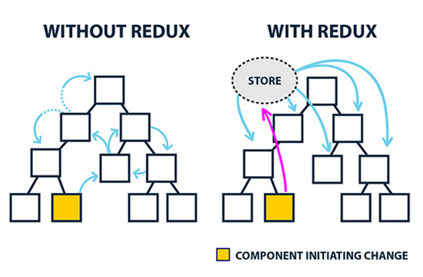
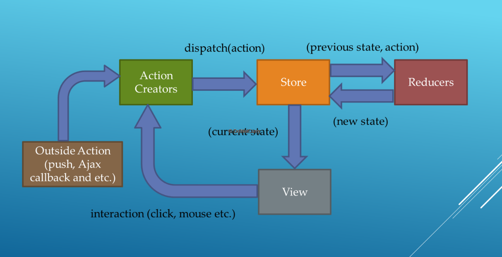

### Redux 
- Redux is a predictable state container for JavaScript apps.
- Redux can be used with React, or with any other view library.
- React is just a view library.
- With redux, React gets the FLUX pattern for state management.
- With Redux, all component level state is completely eliminated and all state is centralized in something called Redux store.
- For simple SPA with a few components, cordinating components is possbile with just React state. But for large SPA with several components, a state management system like Redux becomes essential.



### pure functions
- A pure function is a function which produces no side effects.
- Function with no side effects means:
	- Does not mutate its arguments (array/object)
	- Does not depend or change global variables.
	- No input/output.
	- No DB or Network (API) call.
	- No call to Date.now() or Math.random().

### Immutablility
- In programming, a value which is allowd to change over time is called mutable.
- An immutable value is the exact opposite - after it has been created, it can never change.
- In JS, primitvie datatypes (like Strings and Numbers) are immutable by design. But Objects (including arrays and functions) are mutable.

### FLUX pattern
- Flux is the application architecture that Facebook uses for building client-side web applications. It complements React's composable view components by utilizing a unidirectional data flow. It's more of a pattern rather than a formal framework, and you can start using Flux immediately without a lot of new code.
- React-Flux flow
	1. React (View): Hey Action, someone clicked this "Save Course" button.
	2. Action: Thanks React! I triggered an action creator with the dispatcher, so the dispatcher should take care of notifying all the stores that care.
	3. Dispatcher: Let me see who cares about a course being saved. Ah! Looks like a Store has registered a callback with me, so I’ll let her know.
	4. Store: Hi dispatcher! Thanks for the update! I'll update my data with the payload you sent. Then I'll emit an event for the React components that care.
	5. React (View): Ooo! Shiny new data from the store! I'll update the UI to reflect this!



```js
/* Actions */
{ 
	type: 'LIKE_ARTICLE', 
	articleId: 42 
}

{ 
	type: 'FETCH_USER_SUCCESS', 
	payload: { id: 3, name:'Mary' }
}

{ 
	type: 'ADD_TODO', 
	text: 'Read the Redux docs.' 
}

/* Reducers */
// Reducers are just pure functions that take the previous state and an action, and return the next state calculated by them in immutable fashion. 
(previousState, action) => newState
```

### React-redux 
- React-redux embraces the idea of separating presentational and container components. 
	- Presentational: How things look.
	- Container: Subscribe to store and dispatch actions
- Container Components are Redux-Aware while presentational components are not.

### Example
```js
/* index.js */
import React from "react";
import ReactDOM from "react-dom";
import { createStore } from "redux";
import { Provider } from "react-redux";
import App from "./components/App";
import userInfoReducer from "./reducers/userInfoReducer";

const store = createStore(userInfoReducer);

ReactDOM.render(
  <Provider store={store}>
    <App />
  </Provider>,
  document.getElementById("root"),
);

/* component (App) */
import React from "react";
import FormContainer from "../containers/FormContainer";
import DisplayContainer from "../containers/DisplayContainer";

class App extends React.Component {
  render() {
    return (
      <div>
        <FormContainer />
        <DisplayContainer />
      </div>
    );
  }
}
export default App;

/* component (Form) */
import React from "react";
import axios from "axios";
import { fetching, fetchSuccess, fetchError } from "../actions/userInfoActions";

class Form extends React.Component {
  constructor() {
    super();

    this.handleClick = this.handleClick.bind(this);
  }

  handleClick(ev) {
    console.log(this.urlTextBox.value);

    const { dispatch } = this.props;

    dispatch(fetching());
    
    axios
      .get(this.urlTextBox.value)
      .then(response => {
        dispatch(fetchSuccess(response.data));
        console.log(response);
      })
      .catch(error => {
        dispatch(fetchError(error.message));
        console.log(error);
      });
  }

  render() {
    console.log("<Form/> Props: ", this.props);
    return (
      <div>
        <form>
          <input
            type="text"
            size="75"
            ref={node => {
              this.urlTextBox = node;
            }}
          />
          &nbsp;&nbsp;&nbsp;
          <input
            type="button"
            value="Get User Info..."
            onClick={this.handleClick}
          />
        </form>
      </div>
    );
  }
}

export default Form;

/* component (Display) */
import React from "react";

class Display extends React.Component {
  render() {
    console.log("<Display/> Props: ", this.props);

    return (
      <div>
        {this.props.fetching ? (
          <h2 style={{ color: "blue" }}>"Fetching data from GitHub..."</h2>
        ) : (
          <div>
            <h3>Name: {this.props.userData.name}</h3>
            <h3>Bio: {this.props.userData.bio}</h3>
            <h3>Location: {this.props.userData.location}</h3>
            <h3>Company: {this.props.userData.company}</h3>
            <h3>GitHub Login: {this.props.userData.login}</h3>
          </div>
        )}
        <h2>{this.props.error}</h2>
      </div>
    );
  }
}
export default Display;

/* userInfoActions */
export function fetching() {
  return {
    type: "FETCHING",
  };
}

export function fetchSuccess(data) {
  return {
    type: "FETCH_SUCCESS",
    data,
  };
}

export function fetchError(message) {
  return {
    type: "FETCH_ERROR",
    message,
  };
}

/* containers (FormContainer) */
import Form from "../components/Form";
import { connect } from "react-redux";

const FormContainer = connect()(Form);

export default FormContainer;


/* containers (DisplayContainer) */
import { connect } from "react-redux";
import Display from "../components/Display";

function mapStateToProps(state, ownProps) {
  return {
    fetching: state.fetching,
    userData: state.userData,
    error: state.error,
  };
}

const DisplayContainer = connect(mapStateToProps)(Display);

export default DisplayContainer;

/* userInfoReducer */
export default function userInfoReducer(
  state = {
    fetching: false,
    userData: {},
    error: "",
  },
  action,
) {
  let newState;

  switch (action.type) {
    case "FETCHING":
      newState = {
        ...state,
        fetching: true,
        userData: {},
        error: "",
      };
      break;
    case "FETCH_SUCCESS":
      newState = {
        ...state,
        fetching: false,
        userData: action.data,
        error: "",
      };
      break;
    case "FETCH_ERROR":
      newState = {
        ...state,
        fetching: false,
        userData: {},
        error: action.message,
      };
      break;
    default:
      newState = { ...state };
      break;
  }

  return newState;
}

```

### References
- [Redux Tutorial](https://www.youtube.com/watch?v=wGy1zNwj3Jg&list=PLVz1UWMtyw51n7FLxcSbh9S23oDUiisc0&index=10)
