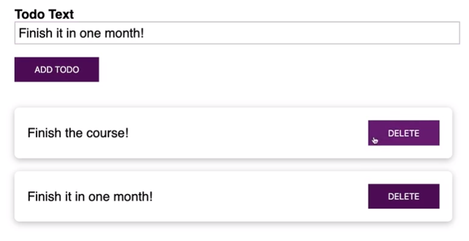

### Project Overivew
- Name: Task Management
- Main Functions
	- Adding a new task
	- Deleting a task
- Development environment
	- TypeScript, React, VSCode
- User Interface



### Set up development environment
- npm install -g create-react-app
- create-react-app todo-app --typescript

```js
/* package.json */
"scripts": {
	"start": "react-scripts start",
	"build": "react-scripts build",
	"test": "react-scripts test",
	"eject": "react-scripts eject"
}

/* tsconfig.json */
{
  "compilerOptions": {
    "target": "es5",
    "lib": [
      "dom",
      "dom.iterable",
      "esnext"
    ],
    "allowJs": true,
    "skipLibCheck": true,
    "esModuleInterop": true,
    "allowSyntheticDefaultImports": true,
    "strict": true,
    "forceConsistentCasingInFileNames": true,
    "module": "esnext",
    "moduleResolution": "node",
    "resolveJsonModule": true,
    "isolatedModules": true,
    "noEmit": true,
    "jsx": "react"
  },
  "include": [
    "src"
  ]
}


/* App.tsx */
import React, { useState } from 'react';
// import { Route } from 'react-router-dom';

import TodoList from './components/TodoList';
import NewTodo from './components/NewTodo';
import { Todo } from './todo.model';

const App: React.FC = () => {
  const [todos, setTodos] = useState<Todo[]>([]);

  const todoAddHandler = (text: string) => {
    setTodos(prevTodos => [
      ...prevTodos,
      { id: Math.random().toString(), text: text }
    ]);
  };

  const todoDeleteHandler = (todoId: string) => {
    setTodos(prevTodos => {
      return prevTodos.filter(todo => todo.id !== todoId);
    });
  };

  return (
    <div className="App">
      <NewTodo onAddTodo={todoAddHandler} />
      <TodoList items={todos} onDeleteTodo={todoDeleteHandler} />
    </div>
  );
};

export default App;

/* TodoList.tsx */
import React from 'react';

import './TodoList.css';

interface TodoListProps {
  items: { id: string; text: string }[];
  onDeleteTodo: (id: string) => void;
}

const TodoList: React.FC<TodoListProps> = props => {
  return (
    <ul>
      {props.items.map(todo => (
        <li key={todo.id}>
          <span>{todo.text}</span>
          <button onClick={props.onDeleteTodo.bind(null, todo.id)}>
            DELETE
          </button>
        </li>
      ))}
    </ul>
  );
};

export default TodoList;

/* NewTodo.tsx */
import React, { useRef, useEffect } from 'react';

import './NewTodo.css';

type NewTodoProps = {
  onAddTodo: (todoText: string) => void;
};

const NewTodo: React.FC<NewTodoProps> = props => {
  const textInputRef = useRef<HTMLInputElement>(null);

  const todoSubmitHandler = (event: React.FormEvent) => {
    event.preventDefault();
    const enteredText = textInputRef.current!.value;
    props.onAddTodo(enteredText);
  };

  return (
    <form onSubmit={todoSubmitHandler}>
      <div className="form-control">
        <label htmlFor="todo-text">Todo Text</label>
        <input type="text" id="todo-text" ref={textInputRef} />
      </div>
      <button type="submit">ADD TODO</button>
    </form>
  );
};

export default NewTodo;

/* index.tsx */
import React from 'react';
import ReactDOM from 'react-dom';

import './index.css';
import App from './App';

ReactDOM.render(<App />, document.getElementById('root'));

/* todo.module.ts */
export interface Todo {
  id: string;
  text: string;
}

```


### References
- [Understanding TypeScript](https://www.eduonix.com/understanding-typescript)

